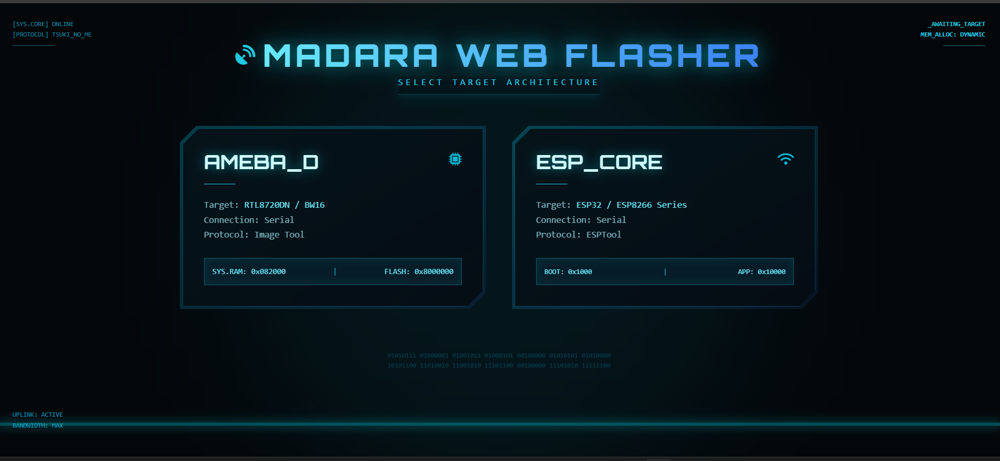
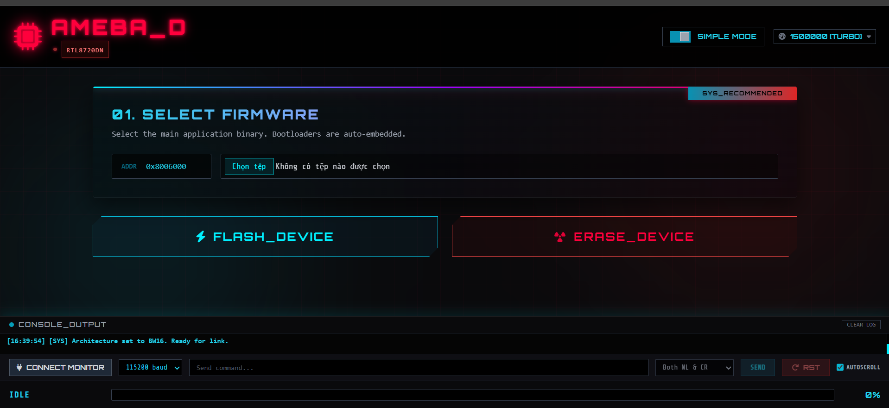
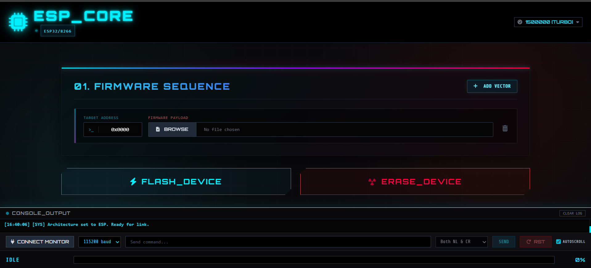

# 🌀 Madara Web Flasher

Công cụ nạp firmware qua trình duyệt dành cho **RTL8720DN (BW16)** và **ESP32/ESP8266**.  
Không cần cài đặt bất kỳ phần mềm nào – chỉ cần trình duyệt Chrome/Edge, cáp USB và file firmware của bạn.

---

## 🚀 Bắt đầu nhanh

---

## ✨ Tính năng chính

| Chức năng | AMEBA_D (BW16) | ESP_CORE |
|-----------|----------------|----------|
| Nạp firmware qua Serial | ✅ (Image Tool protocol) | ✅ (esptool‑js) |
| Xóa toàn bộ flash | ✅ | ✅ |
| Serial Monitor | ✅ | ✅ |
| Chế độ đơn giản (Simple) | ✅ | ❌ |
| Chế độ nâng cao (Advanced) | ✅ | ✅ |
| Bootloader nhúng sẵn | KM0 + KM4 | Không áp dụng |
| Hỗ trợ tốc độ baud tùy chọn | 9600 – 2.000.000 | 9600 – 2.000.000 |
| Tự động đồng bộ tốc độ cao | ✅ | ✅ |

---

## 🧰 Hướng dẫn chi tiết

### 1. Nạp firmware cho **BW16 (AMEBA_D)**

#### 🔹 Chế độ đơn giản (Simple Mode – khuyên dùng)

- Bootloader **KM0** và **KM4** đã được tích hợp sẵn trong code, bạn không cần chọn chúng.
- Chỉ cần nhấn nút **Browse** trong mục `01. SELECT FIRMWARE` để chọn file firmware ứng dụng (thường có tên `km0_km4_image2.bin`).
- Công cụ sẽ tự động ghi:
  - `0x8000000` – KM0
  - `0x8004000` – KM4
  - `0x8006000` – Ứng dụng (địa chỉ mặc định, có thể thay đổi trong code)

#### 🔹 Chế độ nâng cao (Advanced Mode)

- Tắt công tắc **Simple Mode** để hiển thị các mục:
  - **CORE RAM INJECTOR**: chọn file flashloader (nạp vào RAM tại `0x082000`).
  - **FIRMWARE SEQUENCE**: thêm các dòng với địa chỉ + file firmware tùy ý.
- Nhấn **Add Vector** để thêm dòng mới, nhập địa chỉ hex và chọn file `.bin` tương ứng.
- Flashloader sẽ được gửi vào RAM trước, sau đó được dùng để ghi các ảnh còn lại.

#### 🔹 Vào chế độ Bootloader

- Công cụ cố gắng tự động đưa chip vào chế độ Download. Nếu không thành công:
  1. Nhấn và **giữ** nút **DOWNLOAD** (hoặc **BOOT**) trên board.
  2. Nhấn nút **RESET** rồi thả ra.
  3. Thả nút **DOWNLOAD**.
- Quan sát log, khi thấy dòng “Device detected in Bootloader Mode” là đã sẵn sàng.

---

### 2. Nạp firmware cho **ESP32 / ESP8266**

- Sau khi chọn **ESP_CORE**, giao diện sẽ ở chế độ Advanced (không có Simple Mode).
- Thêm ít nhất một dòng firmware với địa chỉ và file. Ví dụ:
  - Bootloader: `0x1000`
  - Partition table: `0x8000`
  - Ứng dụng: `0x10000`
- Nhấn **FLASH_DEVICE**. Công cụ sẽ tự động:
  - Kết nối và đồng bộ với chip (hỗ trợ tự động reset vào chế độ download trên nhiều board).
  - Phát hiện tên chip và thông số flash.
  - Chỉ xóa những sector cần ghi (không xóa toàn bộ flash trừ khi bạn dùng nút **ERASE_DEVICE**).
  - Nạp dữ liệu và reset lại board khi hoàn tất.

---

### 3. Serial Monitor (Theo dõi cổng COM)

- Nằm ở phần Console bên dưới.
- Nhấn **Connect Monitor**, chọn tốc độ baud (mặc định 115200).
- Ô input cho phép bạn gửi lệnh qua Serial, hỗ trợ chọn kiểu kết thúc dòng (None, `\n`, `\r`, `\r\n`).
- Nhấn **Send** hoặc phím **Enter** để gửi.
- Nút **RST** (Reset) sẽ điều khiển chân DTR/RTS để reset board (hữu ích cho ESP, có thể không hoạt động với tất cả mạch nạp).
- **Autoscroll** tự động cuộn xuống dòng log mới nhất.

> ⚠️ **Lưu ý:** Khi bạn nhấn nạp firmware, Monitor sẽ tự động ngắt kết nối để nhường cổng COM cho quá trình flash.

---

## 🧪 Trình duyệt hỗ trợ

| Trình duyệt | Web Serial API | Tình trạng |
|-------------|----------------|------------|
| **Google Chrome** (≥89) | ✅ | Hoạt động tốt |
| **Microsoft Edge** (≥89) | ✅ | Hoạt động tốt |
| **Opera** | ✅ | Hoạt động |
| **Firefox** | ❌ | Không hỗ trợ |
| **Safari** | ❌ | Không hỗ trợ |

---

## 🐛 Xử lý sự cố thường gặp

| Lỗi | Nguyên nhân có thể | Cách khắc phục |
|-----|-------------------|----------------|
| `Failed to execute 'requestPort'` | Trình duyệt không hỗ trợ Web Serial hoặc chưa cấp quyền. | Dùng Chrome/Edge, mở lại trang và cho phép truy cập cổng COM. |
| Không nhận được tín hiệu sync (0x15) từ BW16 | Board chưa vào chế độ download. | Làm theo hướng dẫn “Vào chế độ Bootloader” bên trên. Kiểm tra driver USB (CH340, CP210x). |
| `Write failed at packet X` | Tốc độ baud quá cao, hoặc nguồn cấp cho board yếu. | Hạ tốc độ baud (ví dụ 115200), dùng cáp USB tốt, cấp nguồn ngoài nếu cần. |
| ESP báo `Invalid head of packet` | Sai tốc độ baud hoặc board chưa reset đúng cách. | Giảm tốc độ baud, thử chọn lại cổng COM, nhấn **ERASE_DEVICE** trước rồi mới nạp. |
| `Sync before Exec timeout` (BW16) | Flashloader chưa được gửi thành công hoặc không tương thích. | Kiểm tra file flashloader, đảm bảo đúng định dạng cho RTL8720DN. |
| Monitor không hiển thị dữ liệu | Board không gửi gì qua UART, hoặc đã bị ngắt bởi quá trình flash. | Reset lại board sau khi flash, chọn đúng baud rate. |
| Nút RST không hoạt động | Mạch nạp không hỗ trợ điều khiển DTR/RTS. | Sử dụng nút cứng trên board để reset. |

---

## 📜 Giấy phép & Tác giả

  * Uchiha Madara
  * Tôi nghiên cứu từ 2 link này:
    - https://espressif.github.io/esptool-js/
    - https://nethercap-web-flasher-v2.vercel.app/

**“Wake up to reality! Nothing ever goes as planned in this accursed world.”**  
– Madara Uchiha
